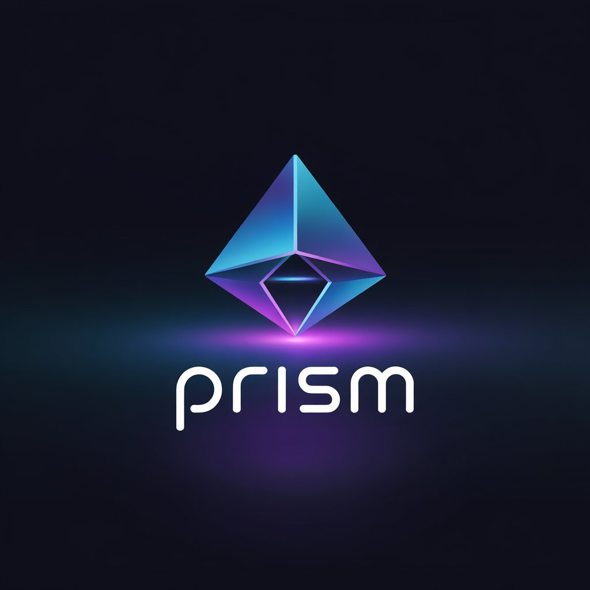

# Prism AI Assistant

<p align="center">
  
</p>

**P**owerful **R**evolutionary **I**ntegrated **S**mart **M**achine (PRISM) is a sophisticated AI assistant with vision capabilities powered by Google's Gemini models. It features real-time web search integration, natural voice synthesis, voice input recognition, and a friendly GUI interface.

## Features

- **Multimodal Support**: Interact with Prism using both text and images via webcam
- **Real-time Web Search**: Get up-to-date information on current events, facts, and more with optimized search queries
- **Natural Voice Synthesis**: Enjoy human-like voice responses with customizable voices
- **Voice Input**: Speak directly to Prism with enhanced speech recognition capabilities
- **Interruption System**: Interrupt Prism's speech at any time when you need to speak
- **User-friendly Interface**: Simple and intuitive UI with togglable webcam, chat history and visual status indicators
- **Flexible Decision Architecture**: Works without rigid if/else statements, allowing the AI to make natural decisions about web searches and image analysis

## About the Developer

Prism AI Assistant was built by Tejas Raj, a 16-year-old developer from Bihar, India. This project demonstrates advanced AI integration and multimodal capabilities using Google's Gemini API.

**Note**: Due to competitive exam preparation, major feature updates are planned to resume one year from now, with more advanced capabilities including enhanced multimodal processing, expanded language support, and deeper contextual understanding.

## Requirements

- Python 3.9 or higher
- Google Gemini API key
- Microphone for voice input capabilities

## Installation

1. Clone this repository:
   ```
   git clone https://github.com/libdo96/Prism.git
   cd Prism
   ```

2. Install the required dependencies:
   ```
   pip install -r requirements.txt
   ```

3. Rename the `.env.example` file in the project root to `.env` and add your Gemini API key:
   ```
   GEMINI_API_KEY=your_api_key_here
   ```

## Usage

1. Run the application:
   ```
   python run.py
   ```
   or use the `run_prism.bat` file on Windows.

2. Interact with Prism:
   - Type your questions in the text field and click Send
   - Toggle the webcam for image-based interactions
   - Select your preferred voice from the dropdown menu
   - Click "Start Voice Input" to use speech recognition (toggle "Continuous Listening" for hands-free operation

## Advanced Features

- **Enhanced Image Analysis**: Improved image handling with multiple fallback methods to ensure reliability
- **Smart Conversation Context**: Prism maintains conversation history to provide more contextual responses
- **Enhanced Speech Recognition**: Optimized speech recognition with better sensitivity and reduced pauses
- **Visual Status Indicators**: UI elements glow to indicate current status (listening, thinking, speaking)
- **Unified Decision Making**: The main LLM handles all categorization for more consistent responses
- **Web Search Integration**: Automatically formats search results with source attribution

## Future Roadmap

The following features are planned for implementation after competitive exams:
- Advanced emotion recognition from voice and facial expressions
- Multi-language support with seamless translation
- Integration with smart home devices and IoT systems
- Custom voice model training options
- Expanded plugin architecture for third-party extensions
- Fully Private mode that can run locally

## Notes

- For the best experience with webcam features, ensure you have proper lighting.
- The voice recognition works best in a quiet environment.
- The app is designed to provide human-like responses with natural speech patterns.

## Support the Project

If you find Prism AI Assistant useful, consider supporting the developer:

<p align="center">
  <a href="https://ko-fi.com/invoidx">
    
  </a>
</p>

## License

MIT License 
